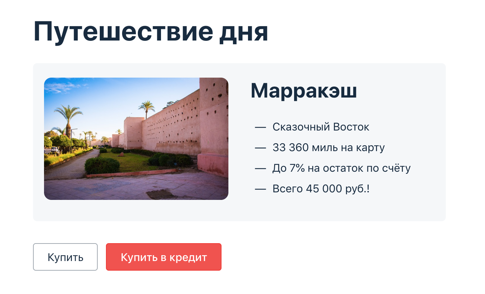

# Дипломный проект по профессии «Тестировщик»

Дипломный проект — автоматизация тестирования комплексного сервиса, взаимодействующего с СУБД и API Банка.

## Описание приложения

### Бизнес-часть

Приложение — это веб-сервис, который предлагает купить тур по определённой цене двумя способами:

1. Обычная оплата по дебетовой карте.
2. Уникальная технология: выдача кредита по данным банковской карты.

Само приложение не обрабатывает данные по картам, а пересылает их банковским сервисам:
* сервису платежей, далее Payment Gate;
* кредитному сервису, далее Credit Gate.

Приложение в собственной СУБД должно сохранять информацию о том, успешно ли был совершён платёж и каким способом. Данные карт при этом сохранять не допускается.

*Важно: в реальной жизни приложение не должно пропускать через себя данные карт, если у него нет PCI DSS, но мы сделали именно так ;)*

## Подготовка тестового окружения для запуска автотестов

### Установить приложения

1. Intelij IDEA 2022.3.2 (Community Edition)
2. Docker Desktop
3. Chromedriver Version: 118.0.5993.70
4. Браузер: Chrome Версия 118.0.5993.89 (Официальная сборка), (64 бит)
5. DBeaver 23.2.2

### Процедура запуска тестов

1. Запускаем Docker Desktop
2. Запускаем IDEA
3. В терминале IDEA набираем `docker compose down`
4. Ждем удаления 3 контейнеров и набираем `docker compose up`
5. Ждем запуска контейнеров _node-app_, _mysql_, _postgres_ и во 2ом терминале для  
запуска джарника набираем `java -jar ./artifacts/aqa-shop.jar`
6. В 3ем терминале запускаем тесты командой `./gradlew clean test --info`
7. Для генерации отчетов на Allure после прохождения тестов набираем в терминале `./gradlew allureserve`
8. По умолчанию в файле _application.properties_ указано подключение к MySQL
Для замены СУБД на PostgreSQL необходимо заменить строку 3 на  
spring.datasource.url=jdbc:postgresql://localhost:5432/app и затем также запусить тесты согласно  
пунктам 3-6  
9. Для отключения джарника или остановки контейнеров нажать `ctrl+C`

## [Отчет о выполнении автоматизированного тестирования](https://github.com/8highflyer8/AqaDiploma/blob/main/Report.md)

## [Отчет по итогам автоматизации](https://github.com/8highflyer8/AqaDiploma/blob/main/Summary.md)

